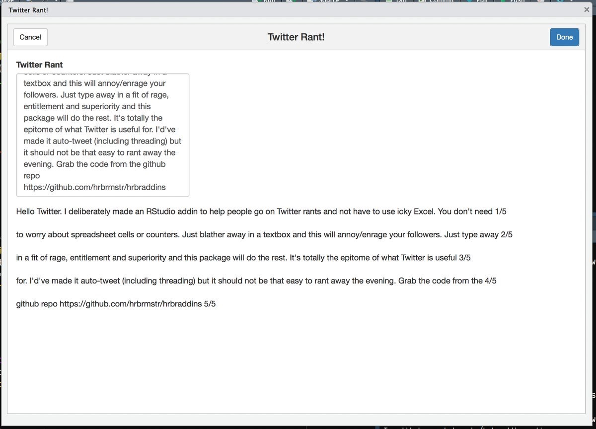

[](http://www.repostatus.org/#active) 
[](https://codecov.io/gh/hrbrmstr/hrbraddins)
[](https://travis-ci.org/hrbrmstr/hrbraddins)

# hrbraddins

Additional Addins for RStudio

## Description

Experiments, mostly. *Please* take the code and use it! This package will NEVER see CRAN. I don't even need credit. If you find something useful and are willing to round out the corners, it's all yours.

## What's in the tin?

The following functions are implemented:

- `refresh_renviron` : Refreshes in-memory R environment variables, noting changes
- `bare_combine`:	Turn a selection of comma-separated bare strings into a - `base::combine`: statement
- `join_rows`:	Join `cr`/`lf`-separated selected rows of text into a single space-separated row

## Examples

### Twitter RANTS!

Use the Addins menu to bring up a dialogue for Twitter Rants!



### Bare Combine

Similarly, the RStudio Addins menu selection "Bare Combine" will take a text selection and make it into a `c()` statement. For example:

    a,b c,d,e f

or

    a, b c, d, e f

will be converted to:

    c("a", "b c", "d", "e f")
    
**NOTE**: not all double-quote edge cases are handled (yet).

### Join Rows

Finally, unless I'm missing something, RStudio doesn't have a "join rows" option, so you can use the RStudio Addins menu selection "Join Rows" to do just that. So:

    a
    b
    c
    d

becomes:

    a b c d

The best way to find out if I'm wrong about that is by doing this tho since the internet will gladly tell me if I'm wrong.

### Installation

```{r eval=FALSE}
devtools::install_github("hrbrmstr/hrbraddins")
```

